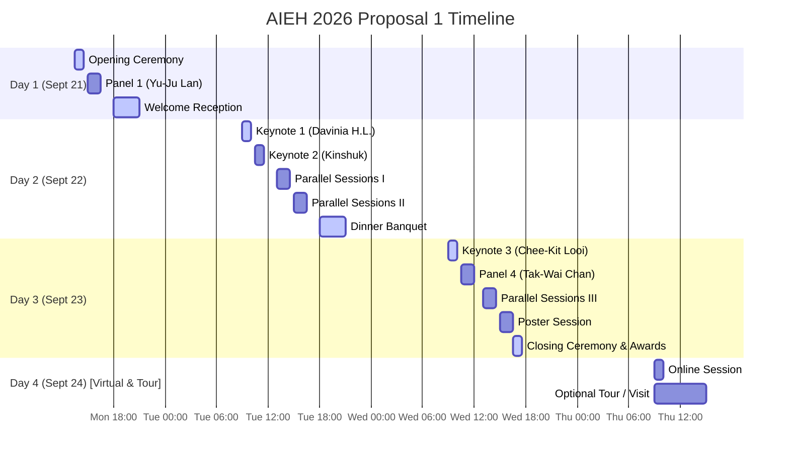

# AIEH 2026 Conference Agenda (Proposal 1)
### The 1st International Conference on AI, Future Educational Scenarios and Transformations, and Global Harwell
**September 21 - September 24, 2026 | Taipei, Taiwan**
**Venue:** Geographic Center (集思台大會議中心)
- **Socrates Hall (蘇格拉底廳):** Plenary Sessions & Panels (145 capacity)
- **Alexander Hall (亞歷山大廳):** Parallel Track A (54 capacity)
- **Nietzsche Hall (尼采廳):** Parallel Track B (48 capacity)
---

## 📋 Agenda At-A-Glance (議程一覽表)

| Time | Day 1: Sept 21 (Mon.) | Day 2: Sept 22 (Tue.) | Day 3: Sept 23 (Wed.) | Day 4: Sept 24 (Thu.) [Virtual & Tour] |
| :--- | :--- | :--- | :--- | :--- |
| **08:30 - 09:00** | — | Registration | Registration | — |
| **09:00 - 10:00** | — | **Keynote Speech 1** Prof. Davinia HERNÁNDEZ-LEO | **Keynote Speech 3** Prof. Chee-Kit LOOI | **Online Session** Virtual Papers (TBA) |
| **10:00 - 10:30** | — | Tea Break | Tea Break | — |
| **10:30 - 12:00** | — | **Keynote Speech 2** Prof. KINSHUK (10:30-11:30) _Lunch (11:30-13:00)_ | **Panel Session 4 (Grand Panel)** Harmony (Moderator: Tak-Wai Chan) | **Optional Tour / Visit** Local Tour or IDC Visit (安排中) |
| **12:00 - 13:00** | — | Lunch | Lunch | — |
| **13:00 - 14:30** | **Registration** (13:00-13:30) **Opening Ceremony** (13:30-14:30) | **Parallel Sessions I** Socrates: Panel 2 Alexander: Track A (4 Papers) Nietzsche: Track B (4 Papers) | **Parallel Sessions III** Socrates: Panel 5 Alexander: Track A (4 Papers) Nietzsche: Track B (3 Papers) | — |
| **14:30 - 15:00** | Tea Break | Tea Break | Tea Break | — |
| **15:00 - 16:30** | **Panel Session 1** Learner Well-being (Yu-Ju Lan) | **Parallel Sessions II** Socrates: Panel 3 Alexander: Track A (4 Papers) Nietzsche: Track B (3 Papers) | **Poster Session** Socrates Hall & Foyer (7 Posters) | — |
| **16:30 - 18:00** | Move to Reception Venue | Move to Banquet Venue | **Closing Ceremony** (16:30-17:30) Closing & Awards | — |
| **18:00 - 21:00** | **Welcome Reception** (18:00-21:00) | **Dinner Banquet** (18:00-21:00) | — | — |

---
## 📅 Schedule Overview

---

## 🏛️ Daily Detailed Agenda

### Day 1: Monday, September 21 (Afternoon)

| Time | Socrates Hall (145 capacity) | Alexander & Nietzsche Halls |
| :--- | :--- | :--- |
| **13:00 - 13:30** | **Registration** | |
| **13:30 - 14:30** | **Opening Ceremony** | |
| **14:30 - 15:00** | **Tea Break** | |
| **15:00 - 16:30** | **Panel Session 1**  **Moderator:** Yu-Ju Lan  **Topic:** *Learner Well-being* | *(Reserved for Professor Lan Yu-Ju)* |
| **16:30 - 18:00** | **Move to Reception Venue (TBD) / Banquet Venue (MRT)** | |
| **18:00 - 21:00** | **Welcome Reception** | *(Welcome Drinks & Networking)* |

---

### Day 2: Tuesday, September 22 (Full Day & Dinner Banquet)

| Time | Socrates Hall (145 capacity) | Alexander Hall (54 capacity) | Nietzsche Hall (48 capacity) |
| :--- | :--- | :--- | :--- |
| **08:30 - 09:00** | **Registration** | | |
| **09:00 - 10:00** | **Keynote Speech 1**  **Speaker:** Prof. Davinia HERNÁNDEZ-LEO  *AI-Supported Collaborative Learning Design* | | |
| **10:00 - 10:30** | **Tea Break** | | |
| **10:30 - 11:30** | **Keynote Speech 2**  **Speaker:** Prof. KINSHUK  *Adaptivity and Personalization in Learning* | | |
| **11:30 - 13:00** | **Lunch** | | |
| **13:00 - 14:30** | **Panel Session 2**  **Moderator:** Siu-Cheung Kong  **Topic:** *Do we need a Global Educational Goal?*  **Panelists:** Kinshuk, Ting-Chia HSU (許庭嘉), Ben Chang, Ivica Botički, Dean Olah | **Parallel Session I (Track A)**  <ul><li>**Full Paper FP1.1:** TBA</li><li>**Full Paper FP1.2:** TBA</li><li>**Full Paper FP1.3:** TBA</li><li>**Full Paper FP1.4:** TBA</li></ul> | **Parallel Session I (Track B)**  <ul><li>**Full Paper FP1.5:** TBA</li><li>**Full Paper FP1.6:** TBA</li><li>**Full Paper FP1.7:** TBA</li><li>**Full Paper FP1.8:** TBA</li></ul> |
| **14:30 - 15:00** | **Tea Break** | | |
| **15:00 - 16:30** | **Panel Session 3**  **Moderator:** Ju-Ling Shih  **Topic:** *Wellbeing*  **Panelists:** Weiqin Chen, 朱蕙君, 林珊如, 于富雲 | **Parallel Session II (Track A)**  <ul><li>**Full Paper FP2.1:** TBA</li><li>**Full Paper FP2.2:** TBA</li><li>**Full Paper FP2.3:** TBA</li><li>**Full Paper FP2.4:** TBA</li></ul> | **Parallel Session II (Track B)**  <ul><li>**Full Paper FP2.5:** TBA</li><li>**Practice Paper PP2.6:** TBA</li><li>**Practice Paper PP2.7:** TBA</li></ul> |
| **16:30 - 18:00** | **Move to Banquet Venue (MRT)** | | |
| **18:00 - 21:00** | **Dinner Banquet** | | |

---

### Day 3: Wednesday, September 23 (Full Day, Poster Session & Closing)

| Time | Socrates Hall (145 capacity) | Alexander Hall (54 capacity) | Nietzsche Hall (48 capacity) |
| :--- | :--- | :--- | :--- |
| **08:30 - 09:00** | **Registration** | | |
| **09:00 - 10:00** | **Keynote Speech 3**  **Speaker:** Prof. Chee-Kit LOOI  *Translating Learning Sciences and AI to Educational Practice* | | |
| **10:00 - 10:30** | **Tea Break** | | |
| **10:30 - 12:00** | **Panel Session 4 (Grand Panel)**  **Moderator:** Tak-Wai Chan  **Topic:** *Harmony*  **Panelists:** Ying-Tien Wu, Hyo-Jeong So, Chee-Kit Looi, Davinia Hernández-Leo, Siu-Cheung Kong, 黃國禎 | | |
| **12:00 - 13:00** | **Lunch** | | |
| **13:00 - 14:30** | **Panel Session 5**  **Moderator:** Ivica Botički  **Topic:** *How does AI contribute to Global Harwell?*  **Panelists:** Yin Yang, Chang-Yen Liao, 劉晨鐘, 楊接期 | **Parallel Session III (Track A)**  <ul><li>**Short Paper SP3.1:** TBA</li><li>**Short Paper SP3.2:** TBA</li><li>**Short Paper SP3.3:** TBA</li><li>**Short Paper SP3.4:** TBA</li></ul> | **Parallel Session III (Track B)**  <ul><li>**Short Paper SP3.5:** TBA</li><li>**Short Paper SP3.6:** TBA</li><li>**Short Paper SP3.7:** TBA</li></ul> |
| **14:30 - 15:00** | **Tea Break** | | |
| **15:00 - 16:30** | **Poster Session**  **Venue:** Socrates Hall & Foyer  *(7 Posters Displayed, Interactive Q&A)* | | |
| **16:30 - 17:30** | **Closing Ceremony & Awards** | | |
| **17:30 ~** | **Farewell & Departures** | | |

---

### Day 4: Thursday, September 24 (Virtual Sessions & Optional Tour)

| Time | Socrates Hall (145 capacity) | Alexander & Nietzsche Halls / Off-site |
| :--- | :--- | :--- |
| **09:00 - 10:00** | — | **Online Session**  *(Video Presentations & Virtual Q&A)*  <ul><li>**Online Full Paper OP1.1:** TBA</li></ul> |
| **09:00 - 15:00** | — | **Optional Social Program & School Visit**  *(Pre-registration Required)* • **Option A:** Local Tour (Guided cultural/historic tour in Taipei/Taoyuan) • **Option B:** School Visit to Taoyuan City Fun-Creator (IDC) International Experimental Education Institution (桃園市趣創者(idc)國際實驗教育機構參訪) *(Under Arrangement / 安排中)* |
| **15:00 ~** | — | **Farewell & Departures** |

---

## 🖼️ Poster Presentations (7 Posters)
Displayed on **Day 3 (September 23) at 15:00 - 16:30** in Socrates Hall & Foyer.
*   **Poster P01:** TBA
*   **Poster P02:** TBA
*   **Poster P03:** TBA
*   **Poster P04:** TBA
*   **Poster P05:** TBA
*   **Poster P06:** TBA
*   **Poster P07:** TBA

---

## 📊 Summary Program Metrics
*   **Keynotes:** 3 sessions (60 mins each)
*   **Panels:** 5 sessions (Panel 1: 90m, Panel 2: 90m, Panel 3: 90m, Panel 4 Grand Panel: 90m, Panel 5: 90m)
*   **Full Papers (FP):** 14 papers (13 in-person, 1 online)
*   **Short Papers (SP):** 7 papers
*   **Practice Papers (PP):** 2 papers
*   **Posters (P):** 7 posters (dedicated 90-minute session on Day 3)
*   **Venues:** Socrates Hall (Plenaries & Panels), Alexander & Nietzsche Halls (Parallel Sessions & Online Session)
*   **Language:** English
